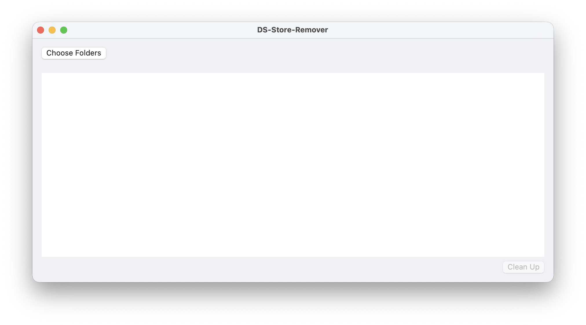
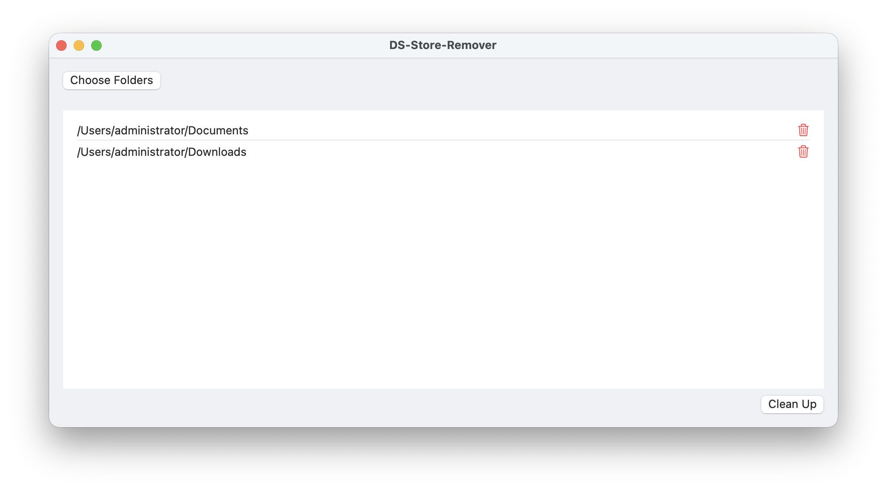

<h1 align="center">
  
</h1>

<h3 align="center">
DS-Store-Remover for macOS
</h3>

## Preview



## The application can't be opened

```bash
sudo xattr -cr /Applications/Ds-Store-Remover
```

## Other Methods to Remove .DS_Store Files
```bash
cd /Users/administrator/Documents
find . -name .DS_Store -type f -delete
```
